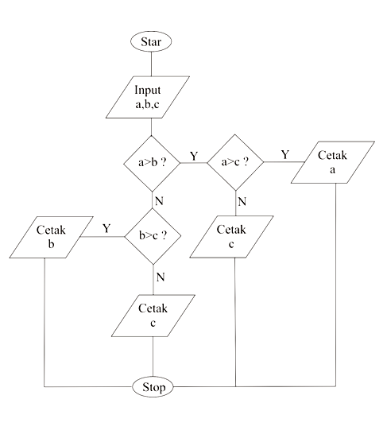

# Menentukan bilangan terbesar dari tiga bilangan

### ---------------------------------------------

1. Mulai

2. Inisialisasi dari integer a,b,c

3. Baca int a,b,c

4. Jika a lebih besar dari b, dan a lebih besar dari c, maka a adalah 
bilangan terbesar.

5. Jika tidak, bilangan b lebih besar dari bilangan a, dan bilangan b 
lebih besar dari bilangan c maka b adalah bilangan terbesar.

6. Jika tidak, c adalah bilangan terbesar

# Flowcart menentukan bilangan terbesar dari tiga bilangan 

# 

## ** Eksekusi : ** 

** 1. Program yang dibuat dari Flowcart di atas **

# 

### ** Penjelasan tentang program **
 
** 1. Inisialisasi dan penginputan **

# 

** 2. Percabangan dan pengulangan **

# 

** 3. Hasil pertama dari program tersebut **

# 

** 4. Hasil kedua dari program tersebut

# 

Demikian penjelasan program menghitung bilangan terbesar dari tiga 
bilangan ini, semoga bermanfaat.. 
